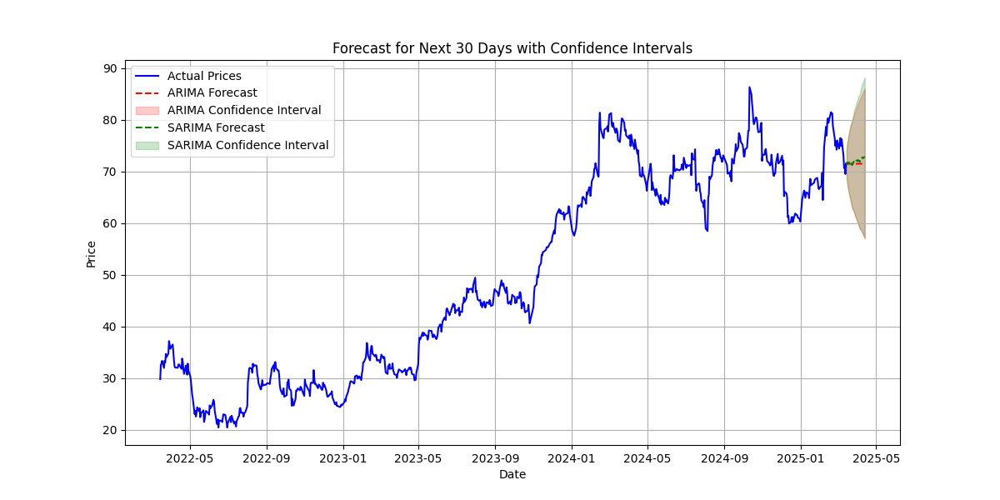

# 🚀 Astrolytics - AI-Powered Time-Series Forecasting

Astrolytics is a time-series forecasting web application that leverages machine learning to analyze and predict stock market trends using real-world financial data retrieved via REST API. The project integrates data preprocessing, exploratory data analysis (EDA), and advanced forecasting models to generate insightful predictions.

---

## 🌟 Features
👉 **Live Deployment** – Access the web application here: **[Astrolytics](https://astrolytics.onrender.com)**.\
✅ **Real-Time Data Retrieval** – Fetch stock price data using Yahoo Finance API.\
✅ **Data Preprocessing** – Handle missing values, ensure data consistency, and perform stationarity checks.\
✅ **Exploratory Data Analysis (EDA)** – Visualize trends, seasonality, and correlations.\
✅ **Machine Learning Models** – Implement ARIMA and SARIMA models for forecasting.\
✅ **Performance Evaluation** – Analyze model accuracy using MSE, RMSE, and MAE.\
✅ **Interactive Web App** – Built using Flask for user-friendly interaction.

---

## 🔧 Tech Stack

- **Programming Language:** Python 🐍
- **Framework:** Flask 🌐
- **Libraries Used:**
  - Pandas (Data Processing)
  - NumPy (Numerical Computations)
  - yFinance (Stock Data API)
  - Matplotlib (Data Visualization)
  - Statsmodels (Time-Series Analysis)
  - Scikit-Learn (Machine Learning)

---

## 📊 How It Works

1️⃣ **Retrieve Data:** Fetch historical stock data based on user input (e.g., company name, time range).\
2️⃣ **Preprocess Data:** Clean missing values, format timestamps, and ensure chronological order.\
3️⃣ **Analyze Data:** Perform trend analysis, seasonal decomposition, and stationarity checks.\
4️⃣ **Train Models:** Implement ARIMA and SARIMA to predict future stock prices.\
5️⃣ **Forecast & Evaluate:** Predict stock trends and measure model performance using standard metrics.\
6️⃣ **Web Deployment:** Deploy as a Flask-based interactive web app.

---

## 🚀 Installation & Usage

### 🔹 Prerequisites

Ensure you have **Python 3.8+** and the required dependencies installed.

### 🔹 Setup

```bash
# Clone the repository
git clone https://github.com/Parikshit-0210/Astrolytics.git
cd Astrolytics

# Install dependencies
pip install -r requirements.txt

# Run the application
python app.py
```

### 🔹 Access the Web App

Once the server is running, open your browser and go to:\
🔗 **[http://127.0.0.1:5000/](http://127.0.0.1:5000/)**

---

## 📌 Project Structure

```
Astrolytics/
│── static/          # Static assets (CSS, JS, images)
│── templates/       # HTML templates for UI
│── app.py           # Flask web application
│── utils.py         # Helper functions for data processing & modeling
│── requirements.txt # Project dependencies
│── README.md        # Project documentation
```

---

## 📈 Example Forecast Output



---

## 💡 Future Enhancements

🔹 Integrate LSTM and Prophet models for better accuracy.\
🔹 Enhance UI/UX for a seamless experience.\
🔹 Add more interactive visualizations.

---

## 🏆 Contributors

👨‍💻 Dhiyanesh B - 23PD08\
👨‍💻 Parikshit V - 23PD24\
👨‍💻 Ramvignesh R - 23PD31\
📧 Contact: [[Astrolytics](mailto\:23pd24@psgtech.ac.in)]

---

## ⚖️ License

This project is licensed under the **MIT License** – feel free to modify and use it!

🔗 **GitHub Repo:** [https://github.com/Parikshit-0210/Astrolytics](https://github.com/Parikshit-0210/Astrolytics)
